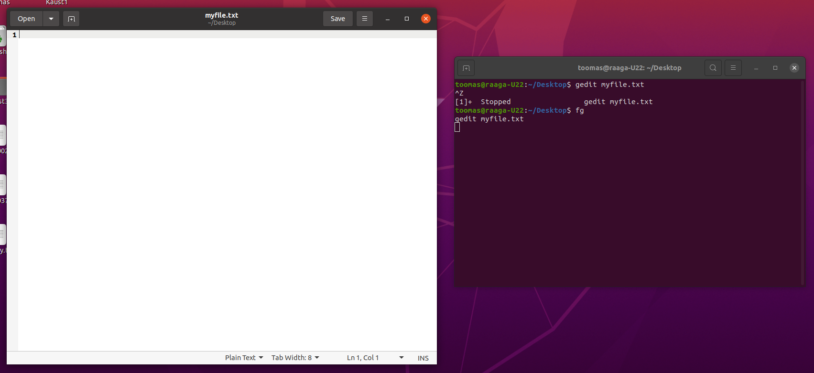
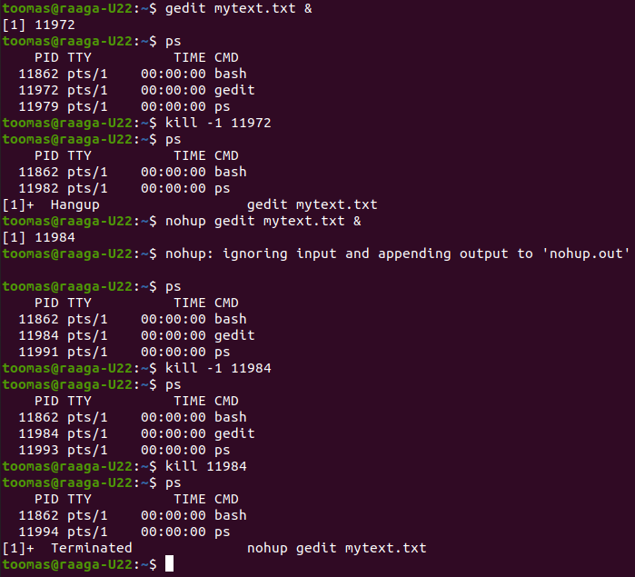
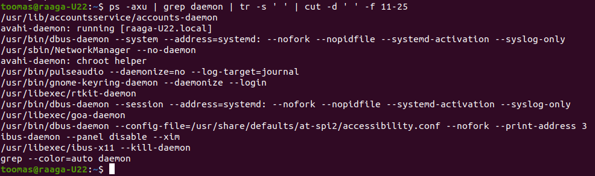
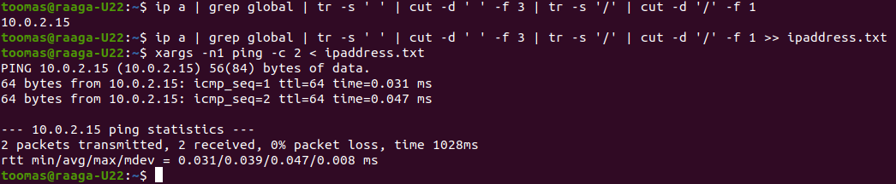

1. Käivita `gedit` käsurealt, nüüd peata programmi töö ajutiselt `CTRL`+`Z` klahvikombinatsiooniga, veendu et `gedit`i aken on hangunud, seejärel saada talle `SIGCONT` signaal ning veendu, et `gedit`i aken toimib jälle. Pane oma vikilehele ekraanitõmmis käskude käivitamisest oma terminaliaknas.
   
   

2. Käivita `gedit` taustal `&` võtmega, saada sellele `SIGHUP` signaal ja veendu, et aken sulgus. Seejärel käivita `gedit` `nohup` käsuga, saada sellele uuesti `SIGHUP` signaal ning veendu, et gedit jääb käima. Nüüd sisesta käsk millega saad `nohup` käivitatud `gedit` protsessi sulgeda. Pane oma vikilehele ekraanitõmmis käskude käivitamisest oma terminaliaknas, sh tõestuseks protsessi kadumise või allesjäämise kohta `ps` käsu väljund.
   
   

3. Koosta ja lisa wikisse käsujada, mis kuvab (modifitseerib) `ps -axu | grep daemon` väljundi nii et tulemuseks oleksid ainult programminimed koos lisaparameetritega (näiteks: `avahi-daemon: running [Perenimi-L21.local]`.
   
   
   
   ```
   
   ```
   
   ```
   ps -axu | grep daemon | tr -s ' ' | cut -d ' ' -f 11-25
   ```

4. Koosta ja lisa wikisse käsujada (ip a | grep ...| ... | cut ... jne), mis kuvab ekraanile vastuseks ainult arvuti ip aadressi (enamasti `10.0.2.15`) `ip a` käsu väljundi põhjal.
   
   
   
   ```
   ip a | grep global | tr -s ' ' | cut -d ' ' -f 3 | tr -s '/' | cut -d '/' -f 1
   ```
